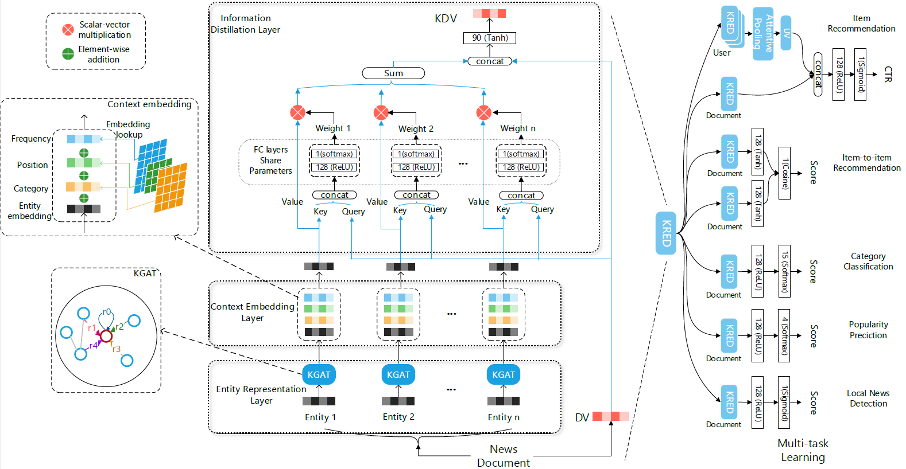

## Introduction

This repository is the implementation of [KRED: Knowledge-Aware Document Representation for News Recommendations](https://arxiv.org/abs/1910.11494)

## Model description



KRED is a knowledge enhanced framework which enhance a document embedding with knowledge information for multiple news recommendation tasks. The framework mainly contains two part: representation enhancement part(left) and multi-task training part(right).

##  Data description

You need to prepare three parts of data for this experiment. We offer a toy example dataset for running the code(demo_data.zip). Each items in files
 are separated with tab.

1 **Graph related data**, including a graph file, an entity vector file, a relation vector file and an entity2id file.
In the graph file, we already changed entities and relations to ids and you can get the vectors in vector files by ids
(e.g. entityid:k is the k<sup>th</sup> vector in entityvec file):
- graph.tsv: triples of knowledge graph:  head, relation, tail
- entity2vec.vec: entity embedding from news graph triples using [TransE](https://github.com/thunlp/Fast-TransX), each line 
is an entity's embedding vector and we can match it to entity according to its line number, so we don't have entityid in this file.
- relation2vec.vec relation embedding same with entity embedding.
- entity2id.txt: entity, entityid
- relation2id.txt: relation, relationid

2 **Multi-task train and test data** including 

user to item recommendation:
- u2i_train.tsv: train file including userid, docid, label
- u2i_test.tsv: val file including sessionid, userid, docid, label

item to item recommendation:
- i2i_train.tsv: docid1, docid2, label
- i2i_test.tsv: docid1, docid2, label

category classification:
-cate_train.tsv: docid, label
-cate_test.tsv: docid, label

local news detection:
- local_train.tsv: docid, label
- local_test.tsv: docid, label

popularity prediction:
- pop_train.tsv: docid, label
- pop_test.tsv: docid, label


3 **User and document data**, including users' click history file and document feature file. For document feature, 
we have the document vector and features of each entities in this document. The format of entity feature is 
entityid, frequency, position, type of this entity and separated with space. Entities in document feature file should be included in entity2id file.
- click_history.tsv: userid, docids
- doc_feature.tsv: docid, entity_features, document vector (the entity features contains of entityid, position, frequency, and entity_type)

## Multi task training

Step1: select training method: single task training or multi task training

Step2: select task, we have 5 core news recommendation tasks, including: user2item recommendation task, item2item recommendation task, 

##  Running the code
```
$ python main.py  (this will run KRED for user2item single task training set by default parameters)
```

## Environment
The code has been tested running under Python 3.6.10, with the following packages installed (along with their dependencies):
- numpy==1.19.1
- pytorchtools==0.0.2
- scikit-learn==0.23.2
- scipy==1.5.2
- torch==1.4.0